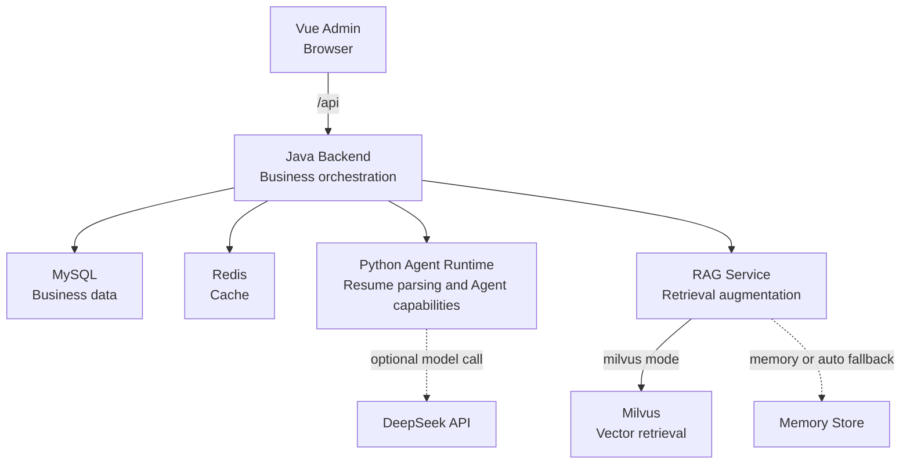

# AI Recruitment Multi-Agent System - English Version

---

[中文文档](README.md) | [English Documentation](README.en.md)

> A locally runnable AI recruitment-assistance system built as a secondary development of an open-source recruitment demo, using a Vue 3 admin workspace, a Spring Boot business backend, a FastAPI Agent Runtime, and a RAG Service.

> Positioning: secondary development / architecture optimization. The current version is intended for local demos, API integration, and engineering practice. It is not an enterprise SaaS product with a complete production authorization model.

## 1. Project Capabilities

- Recruitment workflow: create jobs, candidates, and applications, then upload a resume and trigger analysis.
- Resume handling: the backend limits uploads to 10 MiB and validates the PDF extension and file signature; the Python service extracts resume text.
- Agent capabilities: resume analysis, job-candidate matching, email drafting, interview suggestions, and recruitment Q&A.
- Model integration: calls DeepSeek through the OpenAI-compatible chat/completions API with JSON output. Missing credentials, request failures, or invalid output trigger a deterministic rule-based fallback.
- RAG retrieval: supports text chunking, deterministic local embeddings, similarity search, and `milvus`, `memory`, or `auto` storage modes.
- Milvus retrieval: Milvus mode uses an HNSW + COSINE index and filters by source type, application ID, and job position ID.
- Outputs: displays analysis reports, evidence, email drafts, interview suggestions, and Q&A results. Email is drafted only and is never sent automatically.
- Local deployment: Docker Compose orchestrates MySQL, Redis, etcd, MinIO, Milvus, RAG Service, Python Agent Runtime, Java Backend, and Vue Admin.

## 2. Architecture



| Module | Responsibility |
| --- | --- |
| `frontend/admin` | Vue workflow workspace and result presentation |
| `java-backend` | Business data, state transitions, uploads, caching, and orchestration |
| `python-agent-runtime` | Resume parsing, Agent calls, structured results, and fallback behavior |
| `rag-service` | Chunking, embeddings, vector writes, and retrieval |
| MySQL | Persistent business data for jobs, candidates, applications, resumes, reports, drafts, and interviews |
| Redis | Cache, latest-analysis state, and workflow support data |
| Milvus | Vector retrieval for recruitment knowledge and resume evidence |

## 3. Repository Layout

```text
frontend/admin/        Vue 3 + Vite admin workspace
java-backend/          Spring Boot business backend
python-agent-runtime/  FastAPI Agent Runtime
rag-service/           FastAPI RAG Service
infra/                 Docker Compose, environment template, and runtime data
mysql/                 Database initialization scripts
milvus/                Milvus notes and configuration
redis/                 Redis usage notes
docs/                  Design, API contracts, and implementation records
```

## 4. Requirements

For the full stack, Docker Desktop with Docker Compose and Windows PowerShell or cmd.exe are recommended.

For individual module development:

- Node.js 20+ for the Vue Admin.
- Java 17 and Maven for the Java Backend.
- Python 3.11 for the Python services; the Dockerfiles use Python 3.11 and local tests can use the repository `.venv`.

## 5. Quick Start

### 5.1 Start From The Repository Root

First open a terminal in your local repository root, then run:

```bat
copy infra\.env.example infra\.env
docker compose -f infra\docker-compose.yml --env-file infra\.env up -d --build
docker compose -f infra\docker-compose.yml --env-file infra\.env ps
```

If `infra\.env` already exists, skip the copy command and run `docker compose ... up -d --build` directly.

### 5.2 Start From The `infra` Directory

If you are already in the repository root, you can also start from the `infra` directory:

```bat
cd infra
copy .env.example .env
docker compose --env-file .env up -d --build
docker compose --env-file .env ps
```

### 5.3 Common URLs

Open the admin workspace:

```text
http://localhost:3000
```

Check backend health:

```powershell
Invoke-WebRequest -UseBasicParsing http://localhost:8080/api/health
```

The response should contain `service`, `status`, and MySQL/Redis components:

```json
{
  "service": "ai-recruitment-backend",
  "status": "UP",
  "components": {
    "mysql": "UP",
    "redis": "UP"
  }
}
```

Stop services:

```bat
docker compose -f infra\docker-compose.yml --env-file infra\.env down
```

View logs:

```bat
docker compose -f infra\docker-compose.yml --env-file infra\.env logs -f java-backend frontend-admin
```

## 6. Admin Workflow

```text
Create a job
  -> Create a candidate
  -> Create an application
  -> Upload a PDF resume
  -> Trigger resume analysis
  -> Review the report and evidence
  -> Generate an email draft / interview suggestion / recruitment Q&A
```

During startup, Java Backend may need to wait for MySQL, Redis, RAG Service, or Agent Runtime. The admin page retries the health check automatically after a temporary failure.

## 7. Main API

The Java Backend uses `/api` as its context path:

| Method | Path | Description |
| --- | --- | --- |
| GET | `/api/health` | Business health check with MySQL and Redis status |
| GET | `/api/actuator/health` | Spring Boot Actuator health check |
| GET | `/api/job-templates` | List job templates |
| GET/POST | `/api/jobs` | List or create jobs |
| GET/PUT/DELETE | `/api/jobs/{id}` | Read, update, or delete a job |
| GET/POST | `/api/candidates` | List or create candidates |
| GET/PUT/DELETE | `/api/candidates/{id}` | Read, update, or delete a candidate |
| GET/POST | `/api/applications` | List or create applications |
| GET/PUT/DELETE | `/api/applications/{id}` | Read, update, or delete an application |
| POST | `/api/applications/{id}/resume` | Upload and parse a PDF resume |
| POST | `/api/applications/{id}/analysis` | Trigger resume analysis |
| GET | `/api/applications/{id}/analysis` | Read the latest analysis report |
| POST | `/api/applications/{id}/emails/draft` | Generate an email draft |
| GET | `/api/applications/{id}/emails` | List email drafts |
| POST | `/api/applications/{id}/interviews/propose` | Generate an interview suggestion |
| GET | `/api/applications/{id}/interviews` | List interview suggestions |
| POST | `/api/applications/{id}/qa` | Ask a recruitment question |

The Python Agent Runtime and RAG Service internal APIs are called by Java Backend and should not be exposed directly to the public internet.

## 8. Local Development

Run the frontend in development mode:

```bat
cd frontend\admin
npm install
npm run dev
```

Vite runs on `http://localhost:3000` and proxies `/api` to `http://localhost:8080`. Start Java Backend first.

Run Java Backend separately:

```bat
cd java-backend
rem Set MYSQL_* and REDIS_* to match the actual values in infra\.env first.
rem See java-backend\README.md for the variable list.
mvn spring-boot:run
```

Run the Python services separately:

```bat
cd python-agent-runtime
..\.venv\Scripts\python.exe -m uvicorn app.main:app --host 0.0.0.0 --port 8100

cd ..\rag-service
..\.venv\Scripts\python.exe -m uvicorn app.main:app --host 0.0.0.0 --port 8200
```

## 9. Tests and Verification

Run from the repository root:

```bat
cd frontend\admin
npm test
npm run build

cd ..\..\python-agent-runtime
..\.venv\Scripts\python.exe -m pytest -q

cd ..\rag-service
..\.venv\Scripts\python.exe -m pytest -q

cd ..\java-backend
mvn test
```

The current tests cover frontend report-field parsing, Agent fallback and structured responses, RAG memory retrieval, and Java Backend API/integration clients. A real DeepSeek smoke test requires a valid `DEEPSEEK_API_KEY` and is not part of the default offline test suite.

## 10. Configuration

Main variables are documented in `infra/.env.example`:

| Variable | Purpose |
| --- | --- |
| `BIND_ADDRESS` | Host bind address; defaults to `127.0.0.1` |
| `DEEPSEEK_API_KEY` | DeepSeek credential; empty means fallback |
| `DEEPSEEK_BASE_URL` | OpenAI-compatible API base URL |
| `DEEPSEEK_MODEL` | Model name |
| `DEEPSEEK_TIMEOUT_SECONDS` | Per-request model timeout |
| `RAG_STORAGE_BACKEND` | `milvus`, `memory`, or `auto` |
| `MILVUS_COLLECTION` | Milvus collection name |
| `EMBEDDING_DIMENSION` | Deterministic embedding dimension, default 128 |
| `RAG_CHUNK_SIZE` | Chunk size, default 700 |
| `RAG_CHUNK_OVERLAP` | Chunk overlap, default 120 |
| `RESUME_STORAGE_DIR` | Resume file storage directory |

## 11. Security Boundaries and Limitations

- The admin workspace is intended for local development and demos. Authentication, role-based authorization, and tenant isolation are not implemented, so it must not be exposed directly to the public internet.
- Host ports bind to `127.0.0.1` by default. Do not change this to `0.0.0.0` merely for temporary integration; shared environments should use a TLS-enabled, authenticated, access-controlled reverse proxy.
- Keep `.env`, API keys, and database passwords local. Do not commit them to Git, and replace all example passwords in shared environments.
- The admin workspace persists selection state and job drafts, but not candidate names, email addresses, or phone numbers as PII.
- PDF signature validation reduces disguised-file and parser-abuse risks but is not malware scanning. Production deployments need antivirus scanning and isolated document parsing.
- Email drafts, interview suggestions, and recruitment Q&A are assistive outputs that require human review. The system does not send emails or create real meeting links automatically.
- The current deterministic local embedding has no published recall, ranking-quality, or cost-reduction benchmark.

## 12. Related Documentation

- `infra/README.md`: infrastructure startup, Compose configuration, and security boundaries.
- `frontend/admin/README.md`: frontend development and proxy details.
- `java-backend/README.md`: Java API, workflow rules, and local execution.
- `python-agent-runtime/README.md`: Agent Runtime APIs and DeepSeek configuration.
- `rag-service/README.md`: RAG storage modes, embeddings, and Milvus configuration.
- `docs/`: design documents, API contracts, and implementation records.
