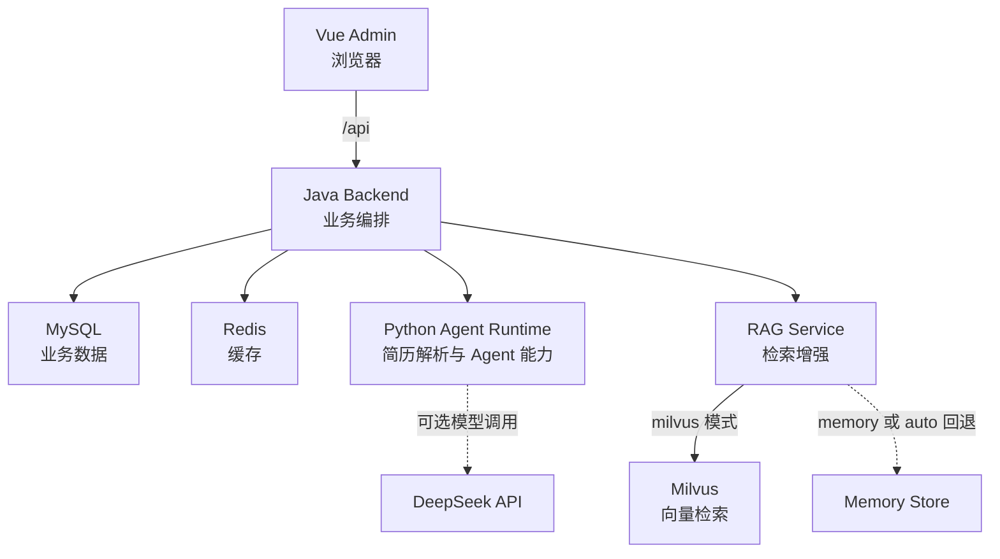

# AI Recruitment Multi-Agent System

---

[中文文档](README.md) | [English Documentation](README.en.md)

> 一个面向本地开发与演示的 AI 招聘辅助系统。项目是在开源招聘 Demo 基础上的二次开发，采用 Vue 3 管理端、Spring Boot 业务后端、FastAPI Agent Runtime 和 RAG Service 分层实现招聘流程闭环。

> 项目定位：secondary development / architecture optimization。当前版本适合本地演示、接口联调和工程实践，不等同于已经具备企业级生产权限体系的 SaaS 产品。

## 中文版

### 1. 项目能力

- 招聘流程：创建岗位、候选人和申请记录，上传简历并触发分析。
- 简历处理：后端限制上传文件不超过 10 MiB，并校验 PDF 扩展名和文件头；Python 服务负责解析文本。
- Agent 能力：简历分析、人岗匹配、邮件草稿、面试建议和招聘问答。
- 模型接入：通过 OpenAI-compatible chat/completions 调用 DeepSeek，并要求 JSON 结构化输出；未配置 API Key、调用失败或返回内容校验失败时，自动使用规则化 fallback。
- RAG 检索：支持文本切分、确定性本地 embedding、相似度检索，以及 milvus、memory、auto 三种存储模式。
- Milvus 检索：Milvus 模式使用 HNSW + COSINE 索引，并支持来源类型、申请 ID 和岗位 ID 过滤。
- 结果输出：展示分析报告、证据、邮件草稿、面试建议和问答结果；邮件只生成草稿，不会自动发送。
- 本地部署：Docker Compose 编排 MySQL、Redis、etcd、MinIO、Milvus、RAG Service、Python Agent Runtime、Java Backend 和 Vue Admin。

### 2. 系统架构

| 模块 | 主要职责 |
| --- | --- |
| frontend/admin | Vue 管理工作台、流程操作和结果展示 |
| java-backend | 业务数据、状态流转、文件上传、缓存和服务编排 |
| python-agent-runtime | 简历解析、Agent 调用、结构化结果和 fallback |
| rag-service | 文本切分、embedding、向量写入和检索 |
| MySQL | 岗位、候选人、申请、简历、报告、草稿和面试建议持久化 |
| Redis | 缓存、最新分析结果和流程辅助状态 |
| Milvus | 招聘知识片段和简历证据的向量检索 |

### 3. 目录结构

    frontend/admin/        Vue 3 + Vite 管理端
    java-backend/          Spring Boot 业务后端
    python-agent-runtime/  FastAPI Agent Runtime
    rag-service/           FastAPI RAG Service
    infra/                 Docker Compose、环境变量示例和运行数据目录
    mysql/                 数据库初始化脚本
    milvus/                Milvus 配置说明
    redis/                 Redis 使用说明
    docs/                  设计、接口契约和实施记录

### 4. 环境要求

推荐使用 Docker Compose 启动完整环境：

- Docker Desktop，支持 Docker Compose。
- Windows PowerShell。

如需单独开发模块：

- Node.js 20+，用于 Vue Admin。
- Java 17、Maven，用于 Java Backend。
- Python 3.11，仓库 Dockerfile 使用 Python 3.11；本地测试使用仓库根目录的 .venv。

### 5. 快速启动

    cd infra
    copy .env.example .env

编辑 infra/.env：

    # 可选。留空时 Agent Runtime 使用规则化 fallback。
    DEEPSEEK_API_KEY=
    DEEPSEEK_BASE_URL=https://api.deepseek.com
    DEEPSEEK_MODEL=deepseek-v4-flash
    DEEPSEEK_TIMEOUT_SECONDS=30

    # 默认只绑定本机，避免数据库和内部服务暴露到局域网。
    BIND_ADDRESS=127.0.0.1

启动全部服务：

    docker compose --env-file .env up -d --build
    docker compose --env-file .env ps

打开管理端：

    http://localhost:3000

检查后端健康状态：

    Invoke-WebRequest -UseBasicParsing http://localhost:3000/api/health

预期响应包含 service、status 和 MySQL/Redis 状态：

    {
      "service": "ai-recruitment-backend",
      "status": "UP",
      "components": {
        "mysql": "UP",
        "redis": "UP"
      }
    }

停止服务：

    docker compose --env-file .env down

查看日志：

    docker compose --env-file .env logs -f java-backend frontend-admin

### 6. 管理端操作流程

    创建岗位
      -> 创建候选人
      -> 创建申请
      -> 上传 PDF 简历
      -> 触发简历分析
      -> 查看分析报告和证据
      -> 生成邮件草稿 / 面试建议 / 招聘问答

首次启动时，如果 Java Backend 需要等待 MySQL、Redis、RAG Service 或 Agent Runtime，前端会显示暂时不可用并自动重试健康检查。

### 7. 主要 API

Java Backend 默认上下文路径为 /api：

| 方法 | 路径 | 说明 |
| --- | --- | --- |
| GET | /api/health | 业务健康检查，包含 MySQL 和 Redis 状态 |
| GET | /api/actuator/health | Spring Boot Actuator 健康检查 |
| GET | /api/job-templates | 查询岗位模板 |
| GET/POST | /api/jobs | 查询或创建岗位 |
| GET/PUT/DELETE | /api/jobs/{id} | 查询、更新或删除岗位 |
| GET/POST | /api/candidates | 查询或创建候选人 |
| GET/PUT/DELETE | /api/candidates/{id} | 查询、更新或删除候选人 |
| GET/POST | /api/applications | 查询或创建申请 |
| GET/PUT/DELETE | /api/applications/{id} | 查询、更新或删除申请 |
| POST | /api/applications/{id}/resume | 上传并解析 PDF 简历 |
| POST | /api/applications/{id}/analysis | 触发简历分析 |
| GET | /api/applications/{id}/analysis | 查询最新分析报告 |
| POST | /api/applications/{id}/emails/draft | 生成邮件草稿 |
| GET | /api/applications/{id}/emails | 查询邮件草稿 |
| POST | /api/applications/{id}/interviews/propose | 生成面试建议 |
| GET | /api/applications/{id}/interviews | 查询面试建议 |
| POST | /api/applications/{id}/qa | 招聘问答 |

Python Agent Runtime 和 RAG Service 的内部接口由 Java Backend 调用，不建议直接暴露到公网。

### 8. 本地开发

前端开发模式：

    cd frontend/admin
    npm install
    npm run dev

Vite 开发服务器默认运行在 `http://localhost:3000`，并把 `/api` 代理到 `http://localhost:8080`。Java Backend 需要先启动。

Java Backend 单独运行：

    cd java-backend
    # 先将 MYSQL_*、REDIS_* 等变量设置为 infra/.env 中的实际值。
    # 变量说明见 java-backend/README.md。
    mvn spring-boot:run

Python 服务单独运行：

    cd python-agent-runtime
    ..\.venv\Scripts\python.exe -m uvicorn app.main:app --host 0.0.0.0 --port 8100

    cd ..\rag-service
    ..\.venv\Scripts\python.exe -m uvicorn app.main:app --host 0.0.0.0 --port 8200

### 9. 测试与验证

从仓库根目录执行：

    cd frontend/admin
    npm test
    npm run build

    cd ..\..\python-agent-runtime
    ..\.venv\Scripts\python.exe -m pytest -q

    cd ..\rag-service
    ..\.venv\Scripts\python.exe -m pytest -q

    cd ..\java-backend
    mvn test

当前测试覆盖前端报告字段解析、Agent fallback/结构化响应、RAG 内存检索和 Java Backend API/集成客户端。真实 DeepSeek smoke test 需要配置有效 DEEPSEEK_API_KEY，不属于默认离线测试的一部分。

### 10. 配置说明

主要环境变量位于 infra/.env.example：

| 变量 | 用途 |
| --- | --- |
| BIND_ADDRESS | 宿主机端口绑定地址，默认 127.0.0.1 |
| DEEPSEEK_API_KEY | DeepSeek 凭据；为空时使用 fallback |
| DEEPSEEK_BASE_URL | OpenAI-compatible API 地址 |
| DEEPSEEK_MODEL | 模型名称 |
| DEEPSEEK_TIMEOUT_SECONDS | 单次模型调用超时 |
| RAG_STORAGE_BACKEND | milvus、memory 或 auto |
| MILVUS_COLLECTION | Milvus collection 名称 |
| EMBEDDING_DIMENSION | 当前确定性 embedding 维度，默认 128 |
| RAG_CHUNK_SIZE | 文本分片大小，默认 700 |
| RAG_CHUNK_OVERLAP | 分片重叠大小，默认 120 |
| RESUME_STORAGE_DIR | 简历文件存储目录 |

### 11. 安全边界与已知限制

- 管理端当前面向本地开发和演示，未实现登录、角色权限和租户隔离，不应直接作为公网服务部署。
- 默认所有宿主机端口只绑定 127.0.0.1。不要为了临时联调直接改成 0.0.0.0；共享环境应通过带 TLS、身份认证和访问控制的反向代理暴露服务。
- .env、API Key 和数据库口令只保留在本机，不要提交到 Git；示例口令必须在共享环境中替换。
- 管理端只持久化当前选择状态和岗位草稿，不持久化候选人姓名、邮箱和手机号等 PII。
- PDF 文件头校验只能降低伪装文件和解析资源滥用风险，不等同于病毒扫描；生产环境需要病毒扫描和隔离解析。
- 邮件、面试建议和招聘问答当前是辅助输出，需要人工复核；系统不会自动发送邮件或创建真实会议链接。
- 当前使用确定性本地 embedding，尚未提供召回准确率、排序质量、成本下降比例等评测指标。

### 12. 相关文档

- infra/README.md：基础设施启动、安全边界和 Compose 配置。
- frontend/admin/README.md：前端开发和代理说明。
- java-backend/README.md：Java API、业务流程规则和本地运行说明。
- python-agent-runtime/README.md：Agent Runtime 接口和 DeepSeek 配置。
- rag-service/README.md：RAG 存储模式、embedding 和 Milvus 配置。
- docs/：技术设计、接口契约和实施记录。
